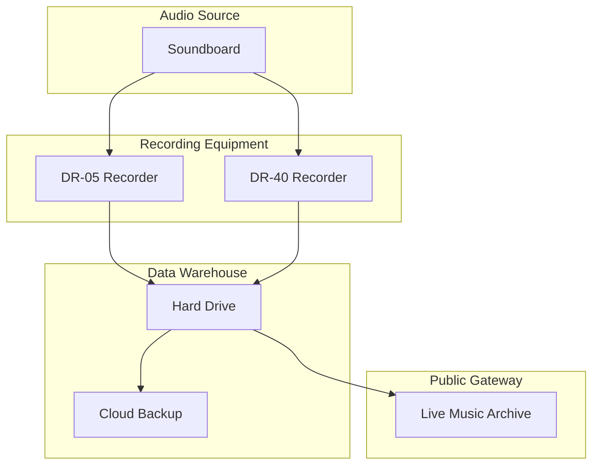
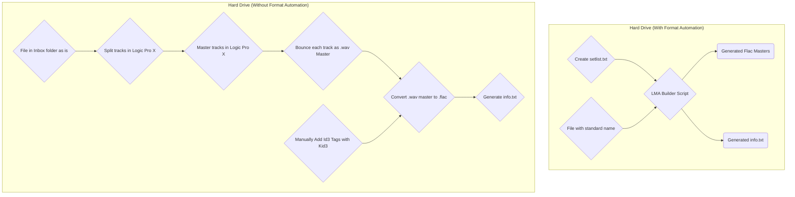

# Featured Recordings
1. [[archive.org] 2019-04-07: Rich Soni Live at the Fine Grind (DR-05)](https://archive.org/details/rs2019-04-07.fine-grind.dr-05)
1. [[archive.org] 2019-05-26: Rich Soni Live at Pine Island Brewery (DR-05)](https://archive.org/details/rs2019-05-26.pine-island-brewery.dr-05)
1. [[archive.org] 2019-06-02: Rich Soni Live at the Fine Grind (DR-05)](https://archive.org/details/rs2019-06-02.fine-grind.dr-05)
1. [[archive.org] 2019-07-06: Rich Soni Live at the Pine Island Brewery (DR-05)](https://archive.org/details/rs2019-07-06.rs2019-07-06.pine-island-brewery.dr-05)
1. [[archive.org] 2019-07-06: Rich Soni Live at Pine Island Brewery (DR-40)](https://archive.org/details/rs2019-07-06.pine-island-brewery.dr-40)  
1. [[archive.org] 2019-07-07: Rich Soni Live at the Fine Grind (DR-05)](https://archive.org/details/rs2019-07-07.fine-grind.dr-05)
1. [[archive.org] 2019-07-07: Rich Soni Live at the Fine Grind (DR-40)](https://archive.org/details/rs2019-07-07.fine-grind.dr-40)

Listed above are the last seven uploads I made to the Live Music Archive.
These are the first to use a set of new structure and tooling which is expected to reduce **Publishing Latency** by a significant factor.

**Publishing Latency** is the time in days between a performance, and its upload date.
This latency is caused by manual work that needs to be done to prepare the recordings (like mastering, and tagging).
The more work required, the longer it takes to publish a recording.

This is precisely what happened to me.
The following graph shows my system before and after improving the publish latency ([fullsize](/images/posts/2019-07-21-publish-latency-analysis.png)).

<a href='/images/posts/2019-07-21-publish-latency-analysis.png'></a>

Notes:
* The green bars here are not all releases using automation, but only ones which occurred after 2019-06-30.  This was the date the script was first functional enough to actually upload.  This is why only 4 of the 7 events listed at the start of this article are marked in the chart.
* The latency went from > 30 days to < 5 days

# Scripting Out The Latency

The following is the architecture of my recording rig:



I estimated the time spent within each section.
Compared to the **Hard Drive** section, the others took negligible time (Full list in Appendix).

| Phase              | Step                         | Estimated Time Spent
| ------------------ | ------------------           | ----------------------------
| Hard Drive         | archive file                 | 15 min
| **Hard Drive**     | **cut tracks/build setlist** | **1.5 hours (avg showTime / 3 ) * 2**
| **Hard Drive**     | **master tracks**            | **9 hours (avg showTime X 3) * 2**
| **Hard Drive**     | **bounce/name tracks**       | **1 hour**
| **Hard Drive**     | **convert tracks**           | **30 min**
| **Hard Drive**     | **tag tracks**               | **30 min**

I did some research, and found a tool called SoX which, after a decent amount of fiddling, was able to do 90% of the work I used to manually do.
Now, the only manual steps are creating the tracklist with the start and end times of each song.
The mastering, tagging, and formatting is all automated.
Even the generation of an info.txt file is automated.

The following diagram compares the processes:



# Pros & Cons: SoX vs. Logic

Having tagging scripts is not very controversial.
Its a pretty reasonable optimization.
I would say the piece that could be open for debate is the use of SoX to manually master instead of using Logic Pro X.

As I see it, here are the pros and cons:

## SoX
### Pros
- Fast
- Self Documenting
- Cross Platform
- Free
- Declarative
- Uniform Sound

### Cons
- rigid
- lower quality

## Logic
### Pros
- Higher quality

### Cons
- Time consuming
- Does not support flac
- not declarative (more permanent)
- Vendor lock in
- Costly

## Further Reading

* [[richsoni.com] Show Recordings on the Internet Archive](posts/2018-10-23-show-recordings-on-internet-archive/)

# The Code

The code is still sort of a mess.
Once its in a better state I will post it.

# Scripts

### Links to recordings posted after 2019-06-30
```
$ curl 'https://archive.org/advancedsearch.php?q=creator%3A%28rich+soni%29+AND+mediatype%3A%28audio+OR+etree%29&fl%5B%5D=identifier&fl%5B%5D=mediatype&fl%5B%5D=publicdate&fl%5B%5D=date&sort%5B%5D=&sort%5B%5D=&sort%5B%5D=&rows=50&page=1&output=json&save=yes%27' | jq '.response.docs | map( {data: ., show: (.publicdate | fromdate | . > ("2019-06-30T00:00:00Z" | fromdate))})' | jq 'map(select( .show )) | map(.data) | map(.identifier) | map("https://archive.org/details/"+.)'

[
  "https://archive.org/details/rs2019-07-06.rs2019-07-06.pine-island-brewery.dr-05",
  "https://archive.org/details/rs2019-07-07.fine-grind.dr-40",
  "https://archive.org/details/rs2019-06-02.fine-grind.dr-05",
  "https://archive.org/details/rs2019-07-07.fine-grind.dr-05",
  "https://archive.org/details/rs2019-04-07.fine-grind.dr-05",
  "https://archive.org/details/rs2019-05-26.pine-island-brewery.dr-05",
  "https://archive.org/details/rs2019-07-06.pine-island-brewery.dr-40"
]
```

[Tascam DR-05]: tk
[Tascam DR-40]: tk
2. **Live Music Archive Queue Size**: The count of performance recordings which are not yet uploaded to the Live Music Archive.  Ideally this would be zero or one.  Then the Live Music Archive could be considered a 'Source of Truth'

### Appendix A: Estimated Times
| Phase              | Step                         | Estimated Time Spent
| ------------------ | ------------------           | ----------------------------
| Soundboard         | Connect devices              | 3 min
| DR-40              | Check levels                 | 1 min
| DR-05              | Check levels                 | 1 min
| DR-40              | start recording              | 1 min
| DR-05              | stop recording               | 1 min
| DR-05              | start recording              | 1 min
| DR-40              | stop recording               | 1 min
| DR-40              | download files               | 15 min
| DR-05              | download files               | 15 min
| Hard Drive         | archive file                 | 15 min
| **Hard Drive**     | **cut tracks/build setlist** | **1.5 hours (avg showTime / 3 ) * 2**
| **Hard Drive**     | **master tracks**            | **9 hours (avg showTime X 3) * 2**
| **Hard Drive**     | **bounce/name tracks**       | **1 hour**
| **Hard Drive**     | **convert tracks**           | **30 min**
| **Hard Drive**     | **tag tracks**               | **30 min**
| Live Music Archive | upload tracks                | 1 hour
|                    | TOTAL TIME                   | ~14 hours

